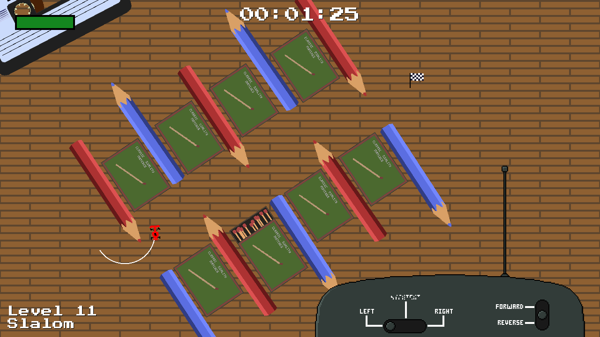

# CircleRC

Left and Right was the temporary name for CircleRC, a Ludum Dare 47 entry on the theme "stuck in a loop". You control an RC car with broken steering that can only go in loops/circles.

## Ludum Dare 47

This repository includes as-of-yet unreleased post-LD improvements. If you want to see the source code as it was when I submitted the game to Ludum Dare, please see the v1.0.0 tag.

## License

Repository is under mixed licensing. Most of it is MIT license but some assets are under other free licenses. Please read LICENSE.txt in the root of the repository for details.
